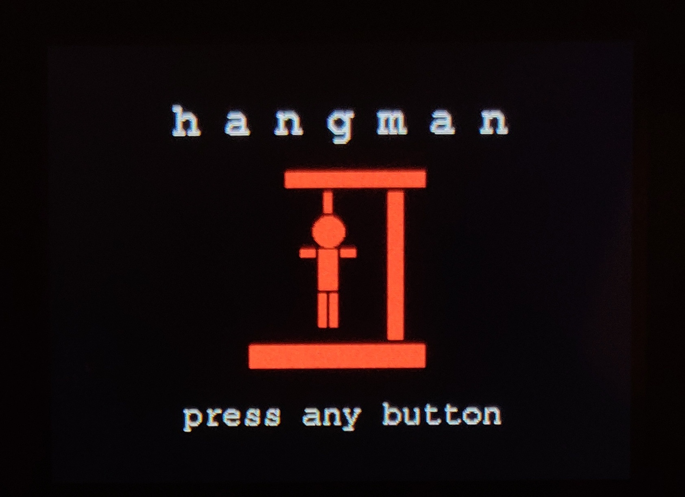
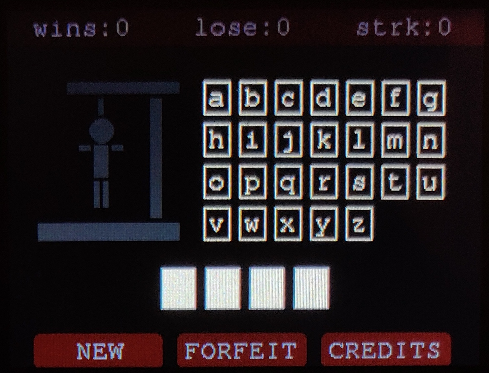
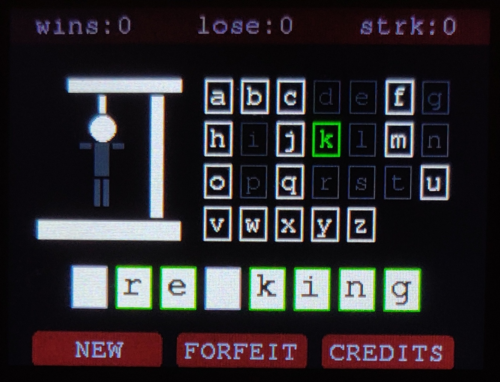

# M5Stack_Hangman

A game of Hangman for use with the M5Stack Faces keyboard module.

  

## Table of contents

- [General info](#general-info)
- [Technologies](#technologies)
- [Setup](#setup)
- [Notes](#notes)
- [Credits](#credits)

## General info

This is a hangman game for use on the M5Stack Faces kit with the keyboard module. The primary purpose of this application was to introduce myself to creating applications on the M5Stack, especially the use of graphics. The application uses the SD card to store a dictionary of words.

## Technologies

- C++ for the game
- Python 3 for creating the dictionary and converting a txt file into PROGMEM
- [M5Stack Faces Kit with keyboard module](https://m5stack.com/products/face)
- [Virtual Studio Code](https://code.visualstudio.com/)
- [PlatformIO](https://platformio.org/)

## Setup

- Download and unzip this repository
- Install Visual Studio Code [https://code.visualstudio.com/](https://code.visualstudio.com/)
- Install the PlatformIO extension
- Install the ESP32 platform on PlatformIO
- Open the M5Stack_Hangman folder on PlatformIO
- Run 'main.py' in 'utils/generate_dict' to create 'clean_dict.txt'
  '''
  $ cd utils/generate_dict
  $ python3 main.py
  '''
- Upload clean_dict.txt to a micro-SD card and place in the M5Stack
- Click the BUILD button to compile the game!

## Notes

- This code relies on an SD card to store a dictionary of words. I included code to convert a txt file of words into a format that is usable in PROGMEM, if you do not have an SD card, but the code will need to be reworked to use PROGMEM.
- The maximum number of letters in the secret word is 10 based on the space available on the screen. You can increase this max length by reducing the size of the letter boxes.

## Credits

- Creator: Clarissa Verish
- Significant contributions from Matthieu Lalonde in 'sd_runner.cpp'

## Next steps

- [ ] Add WiFi capabilites to call a dictionary API so the player can get a hint for their word
- [ ] Add the ability to change the difficulty of the game by changing the minimum and maximum word length
- [ ] Update the code to allow pulling a dictionary from PROGMEM (in the case of no SD card)
